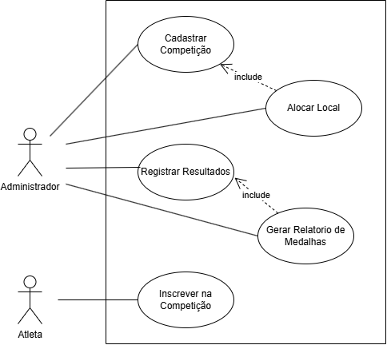
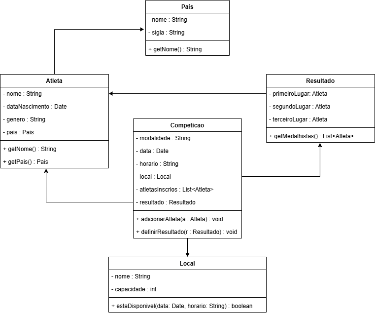
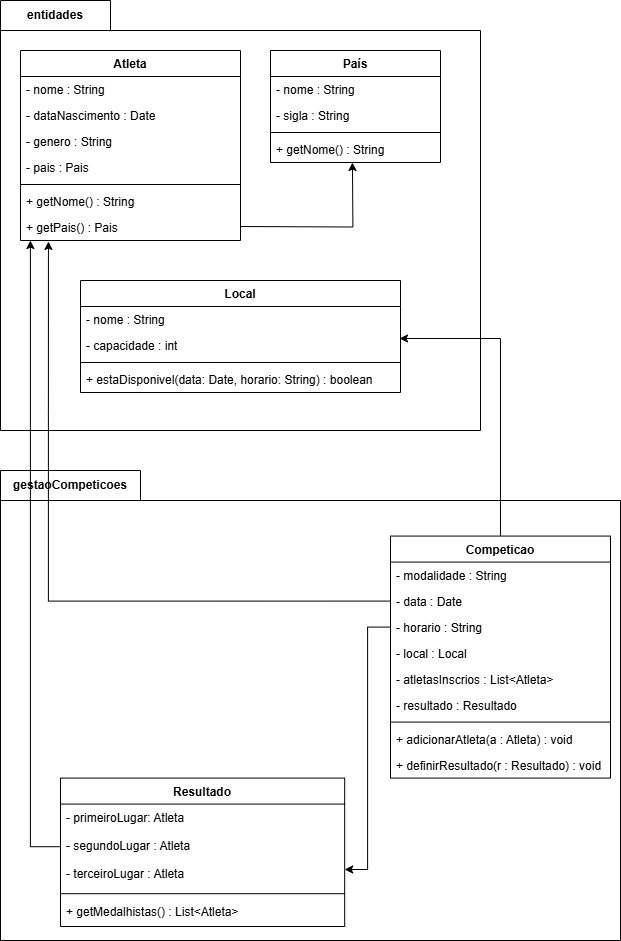
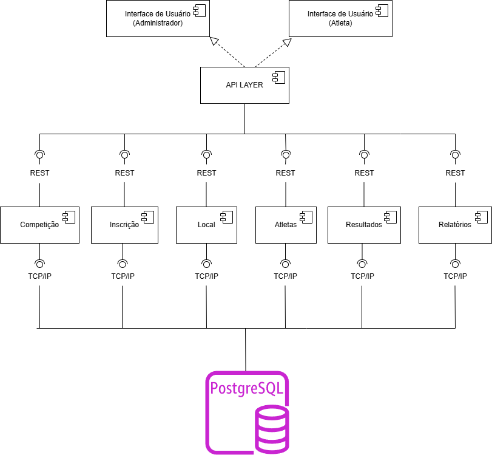
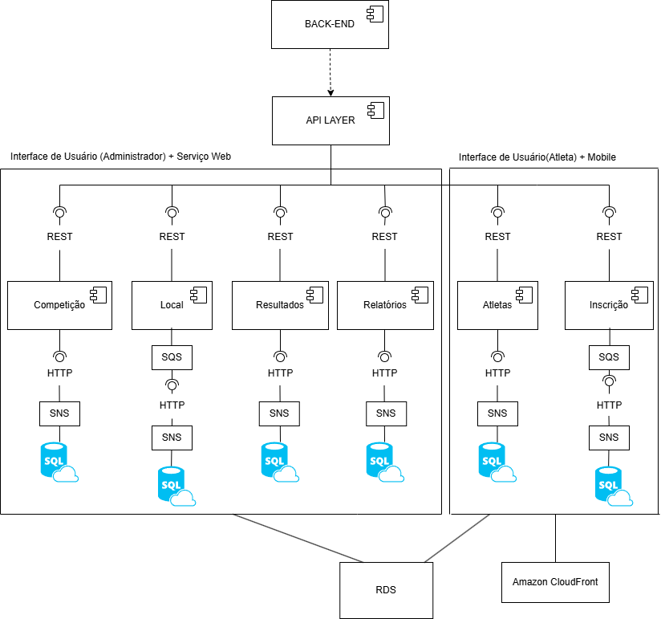

# Sistema de Gestão das Olimpíadas (SGO)

Esse trabalho foi desenvolvido por: 

 * Davi Érico dos Santos 
 * Lucas Maia Rocha

## Histórias de Usuário

| ID    | História de Usuário                                                                 |
|-------|--------------------------------------------------------------------------------------|
| US01  | Como organizador, eu quero cadastrar novas competições para que os atletas possam se inscrever. |
| US02  | Como atleta, eu quero me inscrever em competições disponíveis para representar meu país. |
| US03  | Como sistema, eu preciso validar que o atleta só represente um país por modalidade para garantir as regras olímpicas. |
| US04  | Como organizador, eu quero alocar locais para as competições para evitar conflitos de horário. |
| US05  | Como administrador, eu quero visualizar um cronograma das competições para facilitar a logística do evento. |
| US06  | Como juiz, eu quero registrar os resultados das competições para definir os vencedores. |
| US07  | Como organizador, eu quero gerar relatórios de medalhas para acompanhar o desempenho dos países. |
| US08  | Como espectador, eu quero visualizar os atletas inscritos em uma competição para saber quem irá competir. |
| US09  | Como administrador, eu quero evitar que dois eventos ocorram no mesmo local e horário para manter a organização. |
| US10  | Como responsável pela TI, eu quero que o sistema armazene todas as informações de forma estruturada para facilitar futuras análises. | 

## Diagrama de Caso de uso

## Diagrama de Classes

## Diagrama de Pacotes

## Diagrama de Componentes

## Diagrama de Implantação

